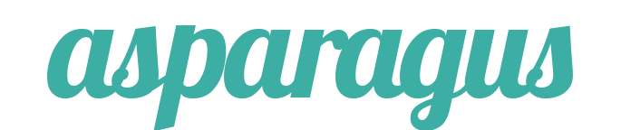
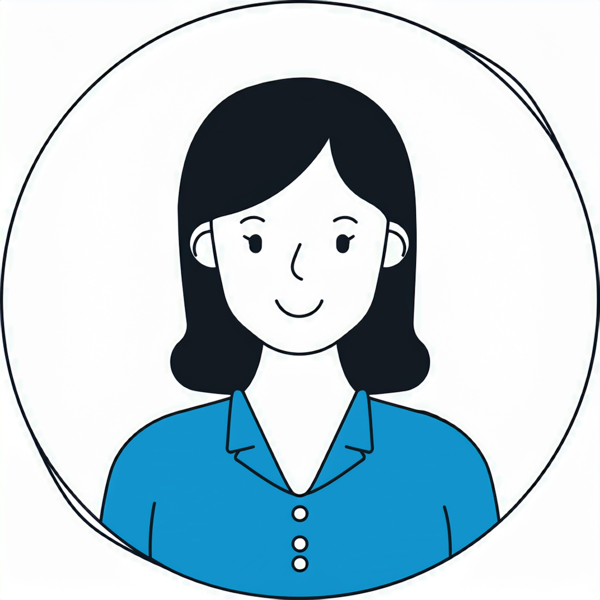
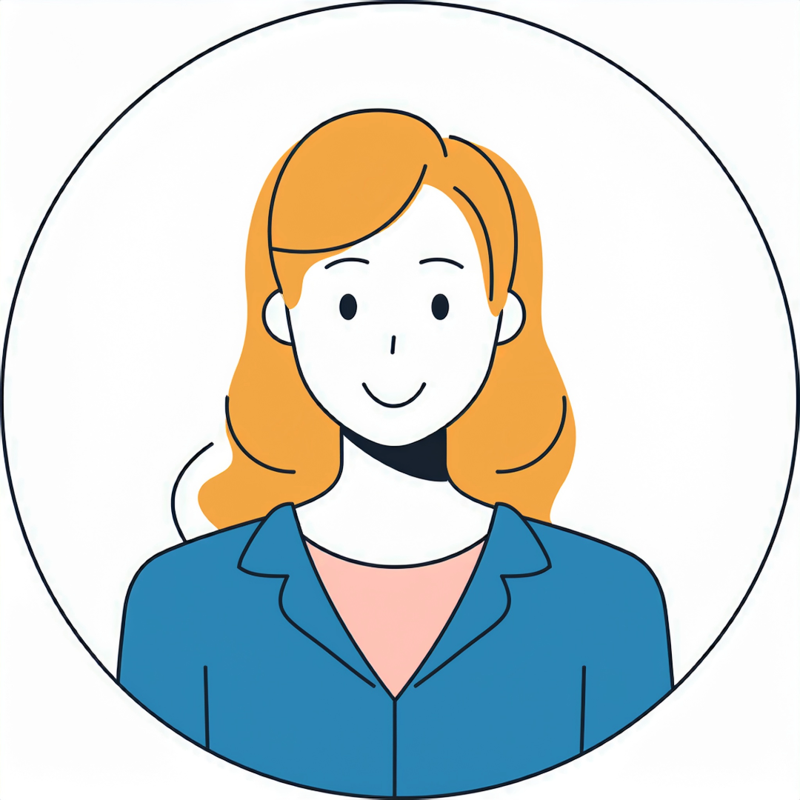
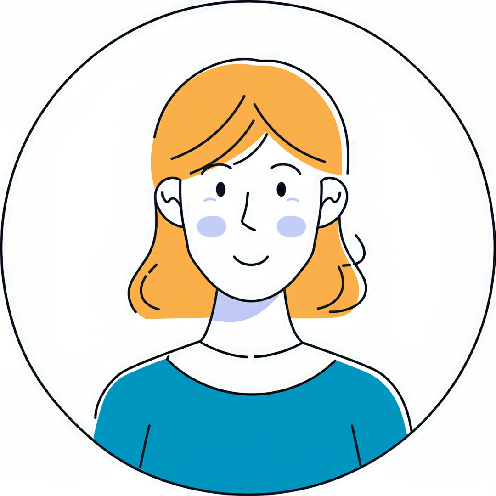
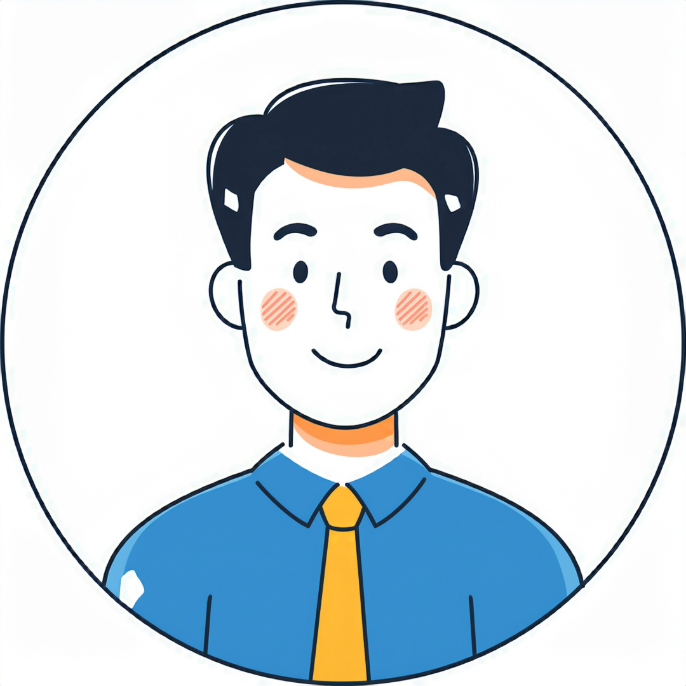
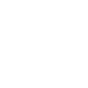
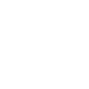

# Responsive Startup Website

## 教材について

この教材の作者は Khondokor Alam@JoyShaheb 氏(https://www.figma.com/@joyshaheb) で、本作はクリエィティブコモンズ 表示 4.0 国際ライセンス（https://creativecommons.org/licenses/by/4.0/deed.ja）にて https://www.figma.com/community/file/1150370769219258177 で配付されており、それにアジャストアカデミーの手で指示を追加したものです。

## フォントファミリー

Google Fonts で以下のフォントを用意して下さい。700等の数値はウェイトです。

- Crimson Text
  - 700
- Roboto
  - 400
- Work Sans
  - 400
  - 500
  - 700

## 色

- ミントグリーン ... #4DA49B
- ボタンの黒 ... #212529

## Breakpoints

デザイン設計上のブレークポイントは一つとしています。

- 375px以下でmobile

HTML/CSSを実装する際にレイアウト崩れが発生するなどの理由で他のブレークポイントを追加してかまいません。
375pxの時にデザインカンプの通りの表示を保つのであれば、ブレークポイントの位置(375px)を変更してもかまいません。

## リセットCSS

リセットCSSの使用は任意です。
使用する場合は自前で調達して下さい。

## 画像素材

画像素材は images/ フォルダに入れてあります。

## テキスト素材（HTML断片）

使用するテキストをHTML断片の形で配付します。
- デザインカンプに現れる順に並べています。
- HTMLは加工してかまいません。必要に応じてクラス名を付けたりdiv要素を挿入したりして下さい。また、他の要素に変更してもかまいません。

<title>Responsive Startup Website</title>

Start

<ul>
	<li><a href="">Home</a></li>
	<li><a href="">Portfolio</a></li>
	<li><a href="">Services</a></li>
	<li><a href="">Contact</a></li>
</ul>

WELCOME

Lorem ipsum dolor sit amet consectetur

Lorem ipsum, dolor sit amet consectetur adipisicing elit. Suscipit nemo hic quos, ab, dolor aperiam nobis cum est eos error ipsum, voluptate culpa nesciunt delectus iste?

Explore

PERTNERS

<h2>Lorem Ipsum Dolor</h2>

Lorem ipsum, dolor sit amet consectetur adipisicing elit.

<ul>
	<li></li>
	<li></li>
	<li></li>
	<li></li>
	<li></li>
</ul>

Learn More

<h2>Lorem ipsum dolor sit amet consectetur</h2>

Lorem ipsum, dolor sit amet consectetur adipisicing elit. Suscipit nemo hic quos, ab, dolor aperiam nobis cum est eos error ipsum, voluptate culpa nesciunt delectus iste?

Learn More

<h2>Lorem ipsum dolor sit amet consectetur</h2>

Lorem ipsum, dolor sit amet consectetur adipisicing elit. Suscipit nemo hic quos, ab, dolor aperiam nobis cum est eos error ipsum, voluptate culpa nesciunt delectus iste?

Learn More

TEAM

<h2>Our Talents</h2>

Lorem ipsum, dolor sit amet consectetur adipisicing elit.

Peg Legge

CEO

Richard Guerra

CTO

Alexandra Stolz

DEDSIGNER

Janet Bray

DEVELOPER

View Team

<ul>
	<li></li>
	<li></li>
	<li></li>
	<li></li>
	<li></li>
	<li></li>
	<li></li>
</ul>

<small>© Lorem, 2025. All rights reserved.</small>

